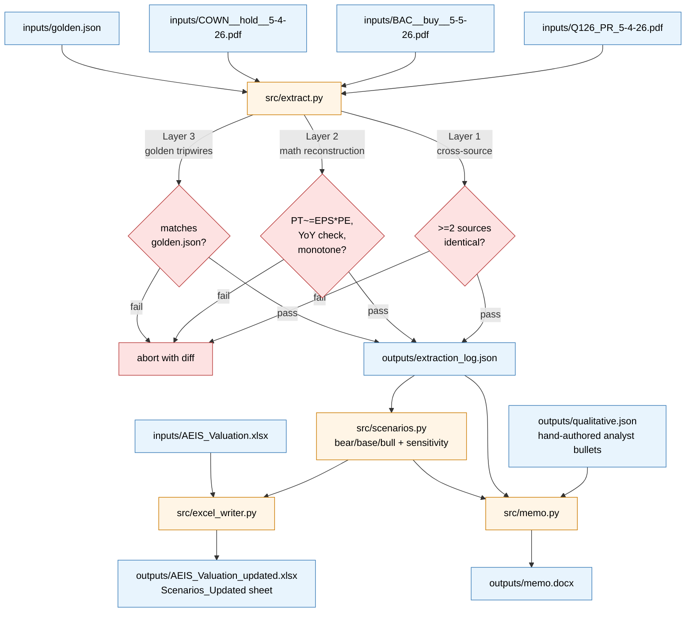

# Architecture

## Pipeline

## Module responsibilities

| Module | Purpose |
|---|---|
| `src/extract.py` | Parse the three PDFs; emit `extraction_log.json` with per-field provenance; run Layers 1/2/3 and raise on any failure |
| `src/qualitative.py` | Load hand-authored `outputs/qualitative.json`; apply soft AEIS-token whitelist to flag generic bullets |
| `src/scenarios.py` | Bear / base / bull constants + computed prices + sensitivity grid axis values |
| `src/excel_writer.py` | Copy original xlsx; add `Scenarios_Updated` sheet with scenarios, what-changed diff, sensitivity grid, color scale, scenario reference rows; inject `<ignoredErrors>` xml for the PW EV cell |
| `src/memo.py` | Build `outputs/memo.docx` with Times New Roman, 1.5 line spacing, italic numerical claims; banned-phrase + word-count scan at build time |
| `run.py` | Single command driver. Calls extract -> qualitative -> scenarios -> excel -> memo |

## Validation layers (in `src/extract.py`)

**Layer 1 — Cross-source agreement.** Every key field must appear in at least two independent occurrences with identical values. The single exception is CY28 Bloomberg consensus, which BAC publishes but Cowen does not; that field passes through Layer 2 (monotone) and Layer 3 (golden) only.

**Layer 2 — Math reconstruction.** Each analyst's PT must equal EPS × PE within 2 percent. BAC's printed YoY EPS percentages must reconstruct from the year-indexed EPS series within 0.1pp. EPS series and Bloomberg consensus series must be monotone increasing across years.

**Layer 3 — Golden tripwires.** Every extracted value must match `inputs/golden.json` exactly. `verification.md` is the audit trail showing where each golden value was sourced in the PDFs.

## Why this split

Deterministic numerical extraction lives in `extract.py` with regex; any drift in upstream PDFs trips a validator instead of silently producing wrong scenarios. Qualitative content (bull/bear bullets, key debate, catalysts) is structurally fuzzier and is hand-authored once into `qualitative.json`, then loaded at every run; this prevents the memo from depending on a live LLM call while keeping the prose subject to human editorial judgment. The memo itself is prose with hand-curated wording, scanned at build time for banned phrases and word count.

## Failure modes

| Failure | Where it surfaces | What to do |
|---|---|---|
| Regex misses a value in a re-issued PDF | Layer 1 or Layer 3 abort | Update the relevant `_extract_*` function in `extract.py`; rerun |
| Analyst revises a number | Layer 3 abort | Update `inputs/golden.json` and `verification.md` to reflect the new value |
| Bloomberg row positions shift years | Layer 2 monotone check or Layer 3 abort | Re-anchor the consensus-row parser in `extract.py` (this happened once; see `verification.md` rows 13–15) |
| Memo prose drifts banned-phrase | `memo.py` raises at build time | Edit the prose constants in `memo.py` |
| Excel `Scenarios_Updated` sheet looks off | `outputs/AEIS_Valuation_updated.xlsx` | Originals (`AEIS`, `Comps`) are untouched; delete the new sheet and rerun |
