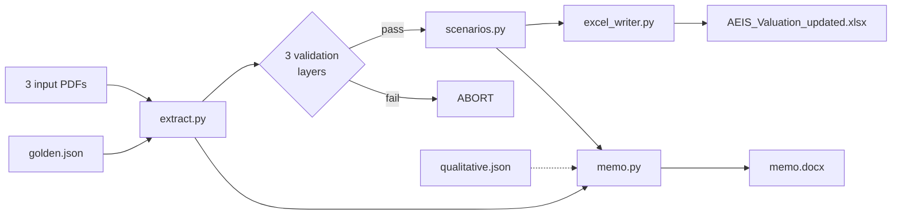

# AEIS Scenario Update

Refreshes a buy side bear / base / bull valuation model for Advanced Energy Industries (NASDAQ: AEIS) after Q1 2026 earnings and two same-week sell side revisions (BofA buy, TD Cowen hold). The pipeline parses the source PDFs deterministically, runs three layers of self-validation against a golden tripwire file, and emits a polished Excel scenario sheet plus a 380 to 420 word memo in Word format. One command, no manual verification step, no live LLM call at run time.

## Quick start

```bash
python3 -m venv .venv
.venv/bin/pip install -r requirements.txt
.venv/bin/python run.py
```

Artifacts land in `outputs/`:

- `extraction_log.json` — every extracted number with PDF page + raw snippet provenance, plus the full validation log
- `qualitative.json` — hand-authored bull/bear/catalyst bullets per analyst (input, not generated)
- `AEIS_Valuation_updated.xlsx` — original `AEIS` and `Comps` sheets untouched, new `Scenarios_Updated` sheet added
- `memo.docx` and `memo.pdf` — PM-facing memo, Times New Roman 12pt body, 1.5 line spacing, italic on key numerical claims. Both formats built from the same prose constants in `src/memo.py`.

## Pipeline overview



See `ARCHITECTURE.md` for the full pipeline diagram with all data flows and the failure-mode table.

## Three validation layers

| Layer | What it checks | Tolerance |
|---|---|---|
| **1. Cross-source agreement** | Every key field appears in 2+ independent occurrences with identical values. | 0 (exact) |
| **2. Math reconstruction** | PT ≈ EPS × PE per analyst; printed YoY EPS percentages reconstruct from the EPS series; year-indexed series monotone increasing. | 2 percent / 0.1pp |
| **3. Golden tripwires** | Every extracted value matches `inputs/golden.json` exactly. | 0 (exact) |

If any layer fails the pipeline aborts and prints the diff. `verification.md` in the repo root is the audit trail showing where each of the 15 golden values was sourced in the PDFs.

## File and module index

```
aeis_scenario_update/
├── inputs/                          source PDFs + golden.json
├── outputs/                         generated artifacts (gitignored)
├── src/
│   ├── extract.py                   PDF parsing + 3 validation layers
│   ├── qualitative.py               loads hand-authored qualitative.json
│   ├── scenarios.py                 bear/base/bull constants + sensitivity
│   ├── excel_writer.py              polished Scenarios_Updated sheet builder
│   └── memo.py                      hand-authored memo prose -> docx
├── tests/                           one test per validation layer
├── run.py                           single-command pipeline driver
├── verification.md                  golden value audit trail
├── ARCHITECTURE.md                  pipeline diagram + failure modes
├── requirements.txt                 pinned dependencies
└── LICENSE                          MIT
```

| Module | One-line purpose |
|---|---|
| `src/extract.py` | Parse 3 PDFs; emit `extraction_log.json`; run Layers 1/2/3 and raise on failure |
| `src/qualitative.py` | Load `qualitative.json`; flag bullets that miss the AEIS-token whitelist |
| `src/scenarios.py` | Bear/base/bull constants + computed prices + sensitivity grid axes |
| `src/excel_writer.py` | Append `Scenarios_Updated` to a copy of the source xlsx |
| `src/memo.py` | Build `memo.docx` with banned-phrase scan + word-count guardrails |
| `run.py` | Orchestrate the pipeline end-to-end |

## Methodology notes

**Why deterministic regex extraction, not an LLM.** Sell side EPS, PE multiples, and price targets are the load-bearing inputs to the model. LLM extraction would introduce a small but real probability of hallucinated or year-shifted numbers, with no audit trail. Regex with named capture groups gives a per-value page citation and a raw snippet so a human can spot-check every field in seconds.

**Why a hand-authored qualitative file.** Analyst rationale (bull/bear bullets, key debate, catalysts) is fuzzy enough that an LLM is a reasonable tool, but the cost of a wrong qualitative bullet is reputational (it ends up in the PM memo) while the cost of correctness is one editorial pass. The hand-authored `outputs/qualitative.json` is committed to the repo and loaded at every run; the AEIS-token whitelist (DC, semi, WFE, 800V, Kyber, PECVD, eVoS, eVerest, NavX, AMAT, LRCX, Artesyn, Industrial, Telecom, margin, Q1, Q2, guide, CY26, CY27) flags any bullet that lacks specific facts.

**Why golden tripwires.** The Bloomberg consensus row issue (see `verification.md` rows 13–15) showed that consensus rows in sell side templates are forward-only and easy to misalign by one year. A 15-field golden file caught this on the first run after the bug; without it the model would have anchored the bear case to the wrong year.

**Why year alignment via the header row.** Consensus rows in BAC and Cowen reports contain three values each. Earlier versions of the parser inferred their year mapping positionally (col 1/2/3 -> CY25/26/27), which produced a one-year shift bug because BAC drops the last completed actual year. The current parser locates the `2024A 2025A 2026E 2027E 2028E` header line, then aligns consensus values to the *last N* year tokens, never the first N.

## Future work

- **Local LLM variant for IP-sensitive environments.** Replace any optional LLM step (currently only the qualitative regeneration path) with an Ollama-served model (e.g., `llama3.1` or `qwen2.5`) so the pipeline can run end-to-end without sending analyst-PDF text to any external API. Swap the `Anthropic` client in a new `qualitative_regen.py` for an Ollama HTTP call; the rest of the pipeline is unchanged.
- **Generalize to other tickers.** Today every parser is tuned to AEIS / BAC / Cowen formats. A `config/{ticker}.yaml` file with regex patterns, header strings, golden values, and scenario constants would let the same pipeline run on any ticker with one config swap. The validation layers stay generic.
- **Real-time refresh on analyst report drop.** Watch an inbox or a SharePoint folder for new analyst PDFs matching a known publisher template. On drop, kick off the pipeline; if Layer 3 fails, surface a diff to the analyst rather than overwriting the model. Pair with a Slack notifier for the abort path.

## Tests

```bash
.venv/bin/python -m pytest tests/
```

Three tests, one per validation layer, that exercise `extract.py` against the committed PDFs and assert each layer's expected pass behavior plus one fault-injection per layer.

## Appendix

- `verification.md` — full 15-value audit trail with PDF page citations and the year-alignment cross-check
- `ARCHITECTURE.md` — full pipeline diagram with failure modes
